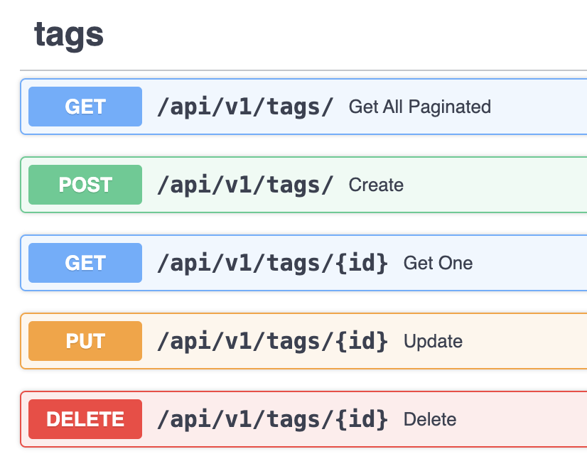
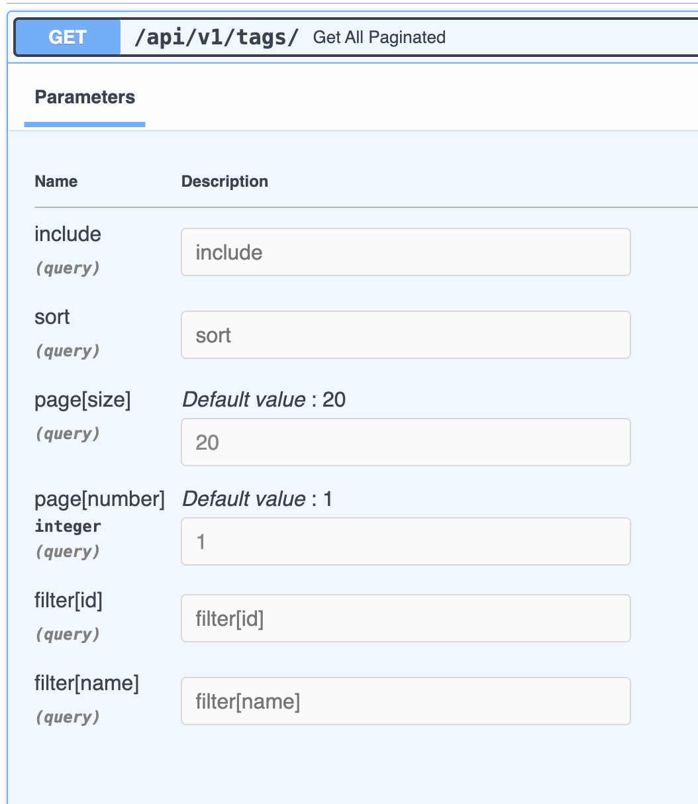
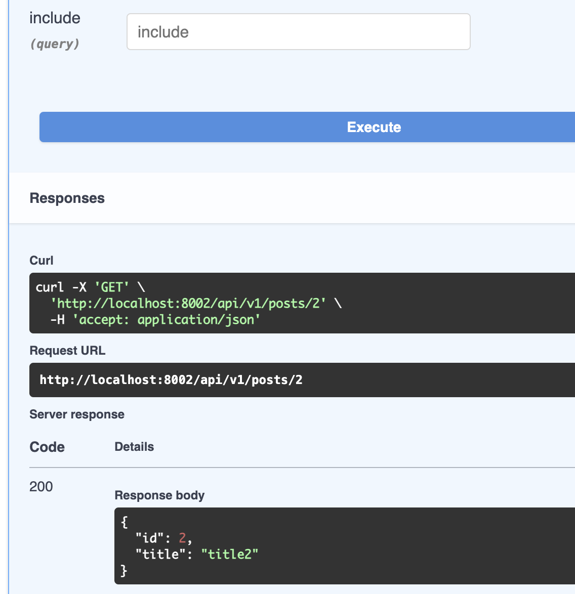
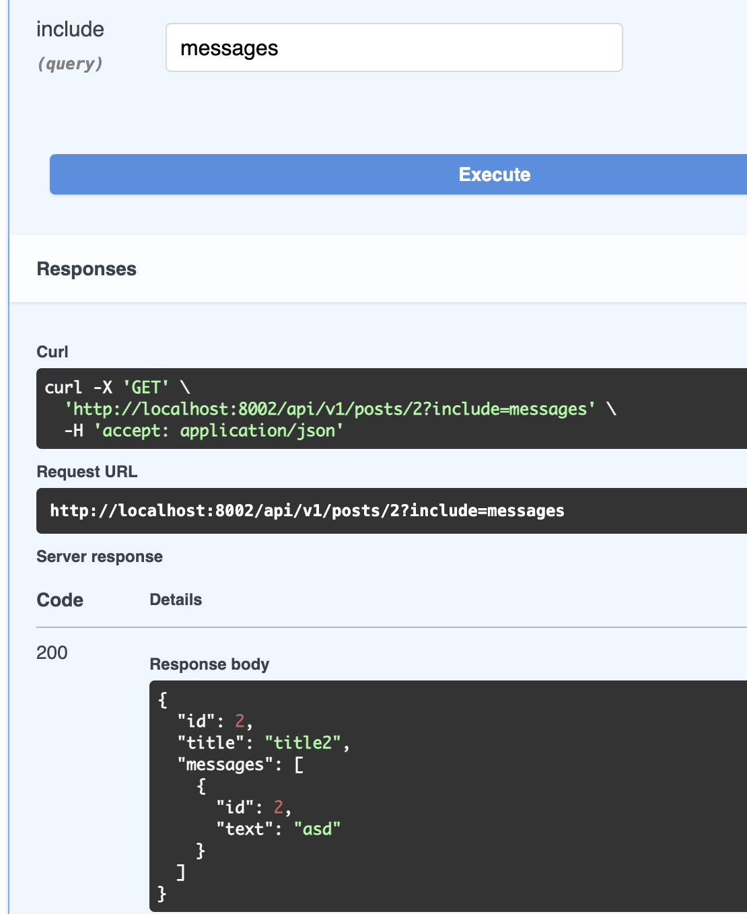
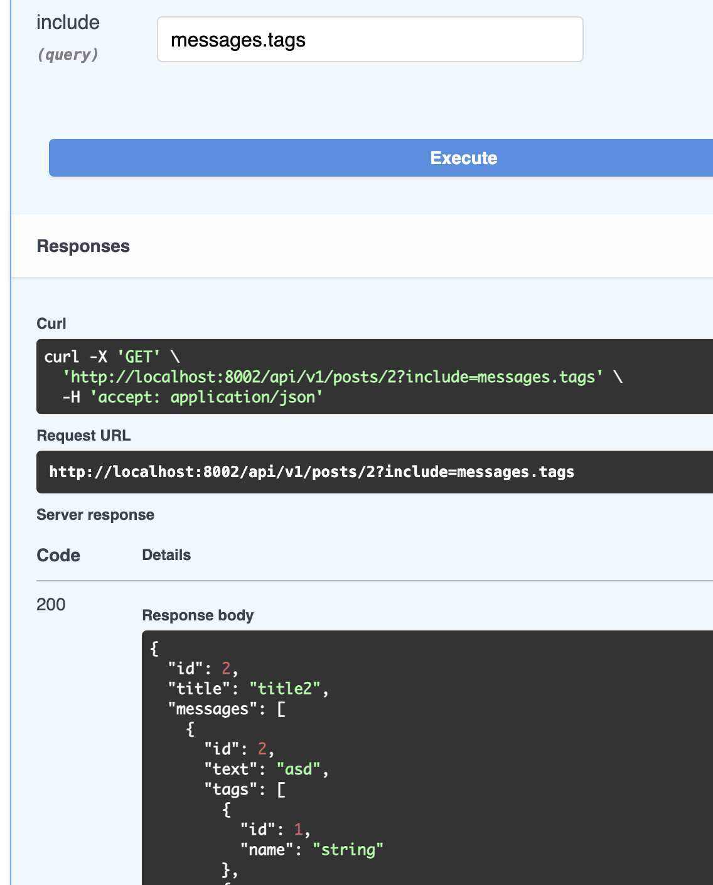

# FastAPI Solo

Welcome to the FastAPI Solo! This library is designed to streamline the development of CRUD-based applications using FastAPI and SQLAlchemy. With a focus on efficiency and customization, it offers utilities for simplifying CRUD endpoint creation, enhancing SQLAlchemy query capabilities and more...

## Table of Contents

- [Introduction](#introduction)
- [Getting Started](getting-started)
- [Usage](#usage)
- [Contributing](#contributing)
- [License](#license)

Feel free to navigate through the sections to learn more about the library's capabilities and how to integrate it into your projects effectively. Let's dive in!

## Introduction

The FastAPI Solo is a versatile toolset designed to expedite the development of CRUD-based applications. Built on top of FastAPI and SQLAlchemy, two powerful Python libraries, this library empowers developers to create robust APIs with minimal effort.

By combining the simplicity of FastAPI's declarative syntax with the flexibility of SQLAlchemy's ORM (Object-Relational Mapping), this library offers a seamless experience for building CRUD endpoints. Whether you're creating a new application or enhancing an existing one, FastAPI Solo streamlines the process, allowing you to focus on business logic rather than boilerplate code.

With a focus on efficiency and extensibility, the library provides utilities for:

Simplifying CRUD endpoint creation for specific models
Enhancing SQLAlchemy query capabilities with usefull filtering, sorting, and pagination features
Customizing response models avoiding circular dependencies
FastAPI Solo also includes a utility for extending FastAPI's dependency injection capabilities beyond the confines of traditional routing contexts. This feature enables the reuse of code written for FastAPI in various scenarios, such as Celery tasks or standalone scripts.

In summary, the FastAPI Solo empowers developers to build scalable, efficient APIs with ease, making it an invaluable tool for CRUD-based application development.





<div>

**Load dynamic relationships with eager loading**







</div>

## Getting Started

To start using the FastAPI Solo, follow these steps:

- install the package

```bash
pip install git+https://github.com/.../fastapi_solo@1.0.0
```

- initialize the database with the SessionFactory.init function after creating the SQLAlchemy engine

```python
from fastapi_solo import SessionFactory
from sqlalchemy import create_engine

engine = create_engine("sqlite:///example.db")
SessionFactory.init(engine)

from fastapi_solo.aio import AsyncSessionFactory
from sqlalchemy.ext.asyncio import create_async_engine

engine = create_async_engine("sqlite+aiosqlite:///example.db")
AsyncSessionFactory.init(engine)
```

This sets up the database for use with the library.

## Usage

The FastAPI Solo offers a straightforward approach to building CRUD-based applications using FastAPI and SQLAlchemy. Below is a guide on how to leverage the library's features effectively:

### Create CRUD Routers

The router class extends the FastAPI Router class, providing the generate_crud method for creating CRUD endpoints for specific models. This method automatically generates the following endpoints:

- GET /: Retrieves all records for the specified model with support for filtering, sorting, pagination and dynamic eager loading of relationships
- POST /: Creates a new record for the specified model
- GET /{id}: Retrieves a specific record by its ID
- PUT /{id}: Updates a specific record by its ID
- DELETE /{id}: Deletes a specific record by its ID

```python
from fastapi_solo import Router

router = Router()

router.generate_crud(User)  # Create all the CRUD endpoints for the User model, you can also pass request and response schemas or disable singular endpoints from parameters

# or you can create more customizable endpoints injecting the right solipsistic dependencies
@router.get("/users", response_model=PaginatedResponse[UserResponse])
def get_users(index: IndexDep[User]):
    return index.execute()

@router.get("/users/custom", response_model=PaginatedResponse[UserResponse])
def get_users_custom(index: IndexDep[User]):
    # index.filter[...], index.sort[], index.include[], index.page, index.size, all the query parameters are available as properties
    q = index.query.filter(...)
    # do some stuff
    return index.paginate_query(q)
    # return paginate_query(index.db, q, index.page, index.size)
    # return paginate_result([...limited_result...], total_count, index.page, index.size)
    # all these pagination functions returns a dict parsable with PaginatedResponse[T]

# prefiltering example, an user can only see his own data
def user_scope(current_user = Depends(get_current_user)):
    return select(User).filter(User.id == current_user.id)

@router.get("/users/scoped", response_model=PaginatedResponse[UserResponse])
def get_users_scoped(index: IndexDep[Annotated[User, user_scope]]):
    return index.execute()

@router.get("/users/{user_id}", response_model=UserResponse)
def get_user(user_id: int, show: ShowDep[User]):
    return show.execute(user_id)

@router.post("/users", response_model=UserResponse)
def create_user(user: UserCreate, create: CreateDep[User]):
    return create.execute(user)

@router.put("/users/{user_id}", response_model=UserResponse)
def update_user(user_id: int, user: UserUpdate, update: UpdateDep[User]):
    return update.execute(user_id, user)

@router.delete("/users/{user_id}")
def delete_user(user_id: int, delete: DeleteDep[User]):
    return delete.execute(user_id)

```

### Enhance Querying with Utilities

Improve SQLAlchemy query capabilities by employing the queryable decorator to create queryable models. This enables efficient filtering, sorting, and pagination in your endpoints.

```python
from fastapi_solo import queryable, select # use select from fastapi_solo instead of sqlalchemy select for the queryable features

@queryable
class User(Base):
    __tablename__ = "users"
    id = Column(Integer, primary_key=True)
    name = Column(String)

    area_id = Column(Integer, ForeignKey("areas.id"))
    area = relationship("Area", back_populates="users")
    posts = relationship("Post", back_populates="user")

    @staticmethod
    def of_area_name_like(query, name):
        return query.join(User.area).filter(Area.name.contains(name))

    @staticmethod
    def by_area_name(query, is_desc):
        return query.join(User.area).order_by(Area.name.desc() if is_desc else Area.name)

@queryable("name") # whitelist queryable fields
class Area(Base):
    __tablename__ = "areas"
    id = Column(Integer, primary_key=True)
    name = Column(String)

    users = relationship("User", back_populates="area")

class Post(Base):
    __tablename__ = "posts"
    id = Column(Integer, primary_key=True)
    title = Column(String)
    content = Column(String)

    user_id = Column(Integer, ForeignKey("users.id"))
    area_id = Column(Integer, ForeignKey("areas.id"))
    user = relationship("User", back_populates="posts")
    area = relationship("Area", back_populates="posts")

# Example usage:

select(User).query_by(name="John", area_name_like="eu") # Filter by name = "John" and area name contains "eu"
select(User).sort("-name", "area_name") # Sort by name descending and area name ascending
select(User).includes("area", "posts.area") # Eager load the area, posts and post's areas relationships

```

**Schemas**
You can use standard Pydantic models as response models, if you want to handle dynamic eager loading of relationships you can use HasOne and HasMany to wrap your dependencies.

```python
from fastapi_solo import HasOne, HasMany

class UserResponse(BaseModel):
    id: int
    name: str
    area: HasOne[AreaResponse]
    posts: HasMany[PostResponse]

```

### Prebuilt dependencies

`SessionDep`: A dependency that provides a SQLAlchemy session for use in your endpoints. It automatically commits the session after the endpoint is executed and rolls back the session if an exception occurs, avoid to use it with sqlalchemy standard manual commits.

```python
from fastapi_solo import SessionDep

@router.post("/users", response_model=UserResponse)
def create_user(user: UserCreate, session: SessionDep):
    user = User(**user.dict())
    session.add(user)
    # session.commit() NOT NEEDED
    return user
```

`RootTransactionDep`: A dependency that provides the root transaction in the context of the request

```python
from fastapi_solo import RootTransactionDep

# if you need to control the transaction manually
@router.post("/users")
def commit_inside(tx: RootTransactionDep):
    User(name="John").save(tx.db)
    tx.force_commit()
    User(name="John2").save(tx.db)
    tx.force_rollback()
```

`IndexDep`: Solipsistic dependency for index endpoints

`ShowDep`: Solipsistic dependency for show endpoints

`CreateDep`: Solipsistic dependency for create endpoints

`UpdateDep`: Solipsistic dependency for update endpoints

`DeleteDep`: Solipsistic dependency for delete endpoints

```python
@router.get("/users", response_model=PaginatedResponse[UserResponse])
def get_users(index: IndexDep[User]):
return index.execute()

```

### Dependency Injection outside FastAPI

Expand FastAPI's dependency injection capabilities beyond traditional routing contexts using the injector decorator. This enables the reuse of FastAPI code in various parts of your application, such as Celery tasks or standalone scripts.

It inject by default FastAPI Request to None and pydantic fields with their default values.
You can override single dependencies by passing a dict to the decorator with the dependency as key and the instance as value.

```python
from fastapi_solo import injector

def dep1():
    yield 1

class Dep2:
    def __init__(self, dep1 = Depends(dep1)):
        self.dep1 = dep1

    def run(self):
        return self.dep1 + 2

@injector
def task(dep2: Annotated[Dep2, Depends()]):
    print(dep2.run())

task()  # This will print 3

@injector(overrides={dep1: 2})
def task2(dep2: Annotated[Dep2, Depends()]):
    print(dep2.run())

task2()  # This will print 4

```

### Testing Utilities:

The FastAPI Solo includes a set of utilities for testing CRUD endpoints, making it easy to validate the functionality of your API.

```python
import fastapi_solo.utils.testing as t

t.validate_relationships(model: str | type[Base])
t.check_filters(client, path: str, filters: dict, expected_result=None, result_count: int = 1)
t.check_sort(client, path: str, field: str = "id")
t.check_pagination(client, path: str, total: int, page_size: int = 2)
t.check_read(client, path: str, id, pk: str = "id", expected_result=None)
t.check_update(client, path: str, json: Optional[dict] = None, data=None, status_code: int = 200, expected_result=None)
t.check_create(client, path: str, json: Optional[dict] = None, data=None, status_code: int = 201, expected_result=None)
t.check_delete(client, path: str, id, status_code: int = 204)
t.match({"test": [1,2,3]}, {"test": t.a_list_of(int)})

```

## License

This project is licensed under the terms of the MIT license.
